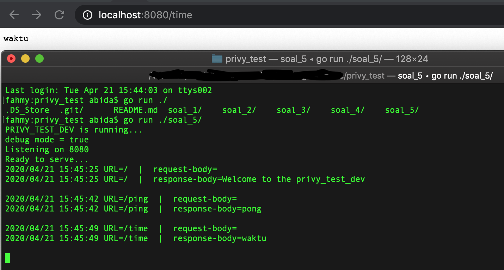

# `TEST CASE`

### All running on root directory repo

### Soal_1

- `go run ./soal_1/main.go`

### Soal_2

- `go run ./soal_2/main.go`

### Soal_3

- `go run ./soal_3/main.go`

### Soal_4 

- Penjelasan ada pada fungsiA di file `./soal_4/main.go`

- `go run ./soal_4/main.go`

### Soal 5

before start make sure environment already exist on Operating System

1. Run on root directory repo

2. `go run ./soal_5/`

